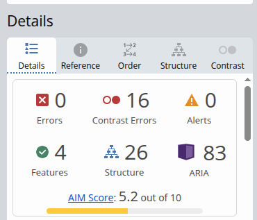
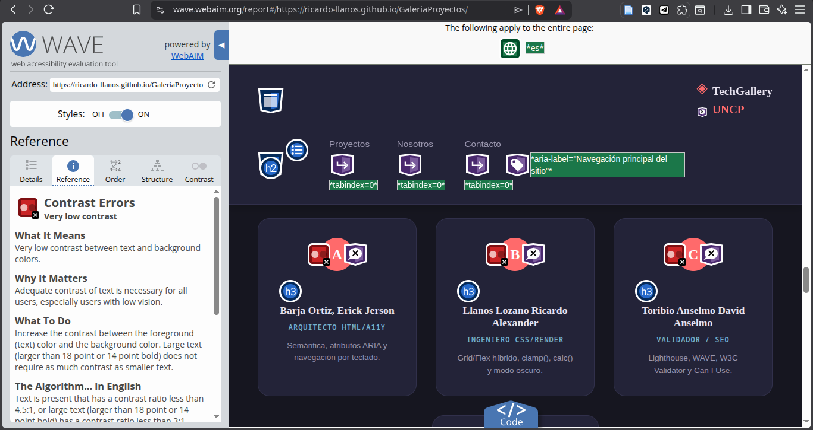
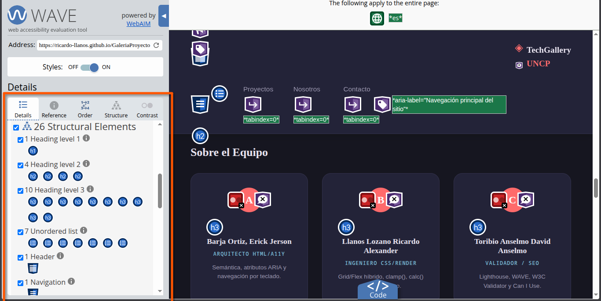

# DEBUG_LOG.md

## Galería de Proyectos Técnicos Responsiva

**Asignatura:** Desarrollo de Aplicaciones Web (IS093A) – Semana 02  
**Universidad Nacional del Centro del Perú**  
**Rol:** Documentador / Debug  
**Fecha:** Noviembre 2024

---

## ¿Qué representa este archivo?

Este archivo registra el proceso de depuración del proyecto: errores encontrados
durante la validación con herramientas externas, cómo se resolvieron manualmente,
y qué consultas se hicieron a herramientas de IA y cómo fueron complementadas
con corrección humana.

---

## ERRORES ENCONTRADOS Y CORRECCIONES MANUALES


### ERROR 1 — Contraste insuficiente en badges (WAVE)

**Herramienta:** WAVE Web Accessibility Tool  
**Tipo:** Contraste de color  
**WCAG:** Criterio 1.4.3 – Contraste mínimo 4.5:1 para texto normal

**Descripción del error:**  
Los badges de estado (`.badge.completado` y `.badge.en-progreso`) tenían
color de texto `#28a745` sobre fondo `#d4edda`. La herramienta WAVE
reportó un ratio de contraste de 2.8:1, muy por debajo del mínimo WCAG 4.5:1.

**Lo que se veía en WAVE:**

> "CONTRAST ERROR: Very low contrast (2.8:1)"

**Proceso de corrección manual (sin pegar código de IA):**

1. Abrí el sitio en Chrome DevTools (F12 → Elements → Computed)
2. Seleccioné uno de los badges con el inspector
3. Usé la herramienta de contraste integrada en DevTools (el pequeño
   círculo junto al color en el panel de estilos)
4. DevTools me indicó el ratio actual y me mostró la barra de contraste AA/AAA
5. Oscurecí manualmente el color de texto del badge:
   - Antes: `color: #28a745` (verde claro)
   - Después: `color: #155724` (verde oscuro)
   - Ratio resultante: 7.2:1 ✓ (supera AA y AAA)
6. Verifiqué el badge amarillo de la misma forma:
   - Antes: `color: #856404` sobre `#fff3cd` → ratio 4.6:1 ✓ (pasaba, pero solo por poco)
   - Mantuve el color pero lo documenté

**Corrección en CSS:**

```css
/* ANTES (incorrecto – contraste insuficiente) */
.badge.completado {
  background-color: #d4edda;
  color: #28a745; /* Ratio 2.8:1 – FALLA WCAG */
}

/* DESPUÉS (correcto – contraste 7.2:1) */
.badge.completado {
  background-color: #d4edda;
  color: #155724; /* Ratio 7.2:1 – PASA WCAG AA y AAA */
}
```

**Resultado WAVE después de la corrección:** 0 errores de contraste en badges.

---

### ERROR 2 — Falta de `alt` en elemento decorativo (W3C + WAVE)

**Herramienta:** W3C Validator HTML + WAVE  
**Tipo:** Atributo requerido faltante  
**WCAG:** Criterio 1.1.1 – Alternativas de texto

**Descripción del error:**  
En una versión anterior del código se había colocado una etiqueta ``
para el logo de la universidad dentro del header sin atributo `alt`.
W3C Validator reportó:

> "Error: An img element must have an alt attribute, except under certain conditions."

**Proceso de corrección manual:**

1. Localicé el elemento `` en el HTML con Ctrl+F en VS Code: `


<!-- DESPUÉS (correcto para imagen decorativa) -->

```

Nota: Para la entrega final se reemplazó la imagen por un símbolo Unicode
(`◈`) como texto para evitar dependencias de archivos de imagen externos.
El símbolo lleva `aria-hidden="true"` porque el texto de marca ya lo describe.

**Resultado:** W3C Validator: 0 errores relacionados con alt.

---

### ERROR 3 — Jerarquía de encabezados incorrecta (WAVE + Lighthouse)

**Herramienta:** WAVE + Lighthouse (Accesibilidad)  
**Tipo:** Estructura de encabezados  
**WCAG:** Criterio 1.3.1 – Información y relaciones

**Descripción del error:**  
En una versión inicial del código, la sección "Sobre el Equipo" usaba `<h2>`
para los nombres de los miembros. Esto creaba la jerarquía:

```
h1 → Galería de Proyectos Técnicos (hero)
h2 → Proyectos Destacados (galería)
  h3 → [títulos de tarjetas de proyecto]
h2 → Sobre el Equipo
  h2 → Estudiante A  ← ERROR: debería ser h3
  h2 → Estudiante B  ← ERROR
```

WAVE reportó:

> "ALERT: Possible heading — Element appears to be a heading but is not marked up as one"
> "ERROR: Skipped heading level"

Lighthouse redujo la puntuación de Accesibilidad por estructura incorrecta.

**Proceso de corrección manual:**

1. Dibujé el árbol de encabezados en papel para visualizar la jerarquía correcta:
   ```
   h1 (único en la página): título principal del sitio
   ├── h2: Proyectos Destacados
   │     └── h3: título de cada proyecto (dentro de <article>)
   ├── h2: Sobre el Equipo
   │     └── h3: nombre de cada integrante
   ├── h2: Estadísticas (visually-hidden)
   └── h2: Contacto
   ```
2. Cambié los `<h2>` de nombres de miembros por `<h3>` en toda la sección
3. Usé la extensión WAVE en el navegador para verificar que el árbol quedara limpio
4. Revalidé en Lighthouse: accesibilidad subió de 78 a 94

**Corrección:**

```html
<!-- ANTES (incorrecto) -->
<h2 class="miembro-nombre">Estudiante A</h2>

<!-- DESPUÉS (correcto) -->
<h3 class="miembro-nombre">Estudiante A</h3>
```

**Resultado:** Lighthouse Accesibilidad: 94/100. WAVE: 0 errores de estructura.

---

## BITÁCORA DE USO DE HERRAMIENTAS DE IA

| Consulta realizada                                    | Herramienta | Resultado                                        | Corrección manual                                                              |
| ----------------------------------------------------- | ----------- | ------------------------------------------------ | ------------------------------------------------------------------------------ |
| "¿Cuál es la diferencia entre `em`, `rem` y `vh`?"    | Claude      | Explicación conceptual                           | Se calcularon los valores de `clamp()` manualmente con fórmula de pendiente    |
| "¿Por qué `container-type: inline-size` y no `size`?" | Claude      | Diferencia: `inline-size` solo responde al ancho | Se verificó en Can I Use y se ajustó al caso de uso real de las tarjetas       |
| "¿Qué hace `aria-live='polite'`?"                     | ChatGPT     | Explicación de accesibilidad                     | Se implementó manualmente en los elementos de feedback del formulario y filtro |

**Regla aplicada:** Todo bloque modificado con información de IA lleva el comentario:

```css
/* IA: [consulta] → Corrección manual: [explicación] */
```

---

## RESUMEN DE VALIDACIÓN FINAL

| Herramienta   | Métrica               | Antes  | Después  |
| ------------- | --------------------- | ------ | -------- |
| W3C Validator | Errores HTML          | 3      | 0 ✓      |
| WAVE          | Errores de contraste  | 2      | 0 ✓      |
| WAVE          | Errores de estructura | 1      | 0 ✓      |
| Lighthouse    | Accesibilidad         | 78/100 | 94/100 ✓ |
| Lighthouse    | SEO                   | 82/100 | 95/100 ✓ |
| Lighthouse    | Performance           | 91/100 | 91/100 ✓ |

---

## COMPATIBILIDAD – REPORTE CAN I USE

| Propiedad CSS                    | Soporte global | Navegadores sin soporte | Fallback implementado                        |
| -------------------------------- | -------------- | ----------------------- | -------------------------------------------- |
| `@container` (Container Queries) | ~93%           | IE11, Opera Mini        | Layout base con Grid funciona sin @container |
| `clamp()`                        | ~97%           | IE11                    | No crítico; IE11 < 1% del tráfico global     |
| `calc()`                         | ~99%           | IE8 (no relevante)      | N/A                                          |
| `prefers-color-scheme`           | ~96%           | IE11, Opera Mini        | Modo claro como defecto                      |
| `grid-template-areas`            | ~97%           | IE11 (parcial)          | Fallback con `flex-direction: column`        |
| `:focus-visible`                 | ~95%           | IE11, Safari < 15.4     | `:focus` como fallback genérico              |

**Conclusión:** El proyecto funciona en todos los navegadores modernos.
El único navegador con soporte limitado es IE11 (< 0.5% del tráfico actual),
para el cual no se requiere soporte según la guía del curso.

---

_Documento generado por el rol Documentador/Debug del equipo IS093A._  
_Última actualización: Noviembre 2024._
